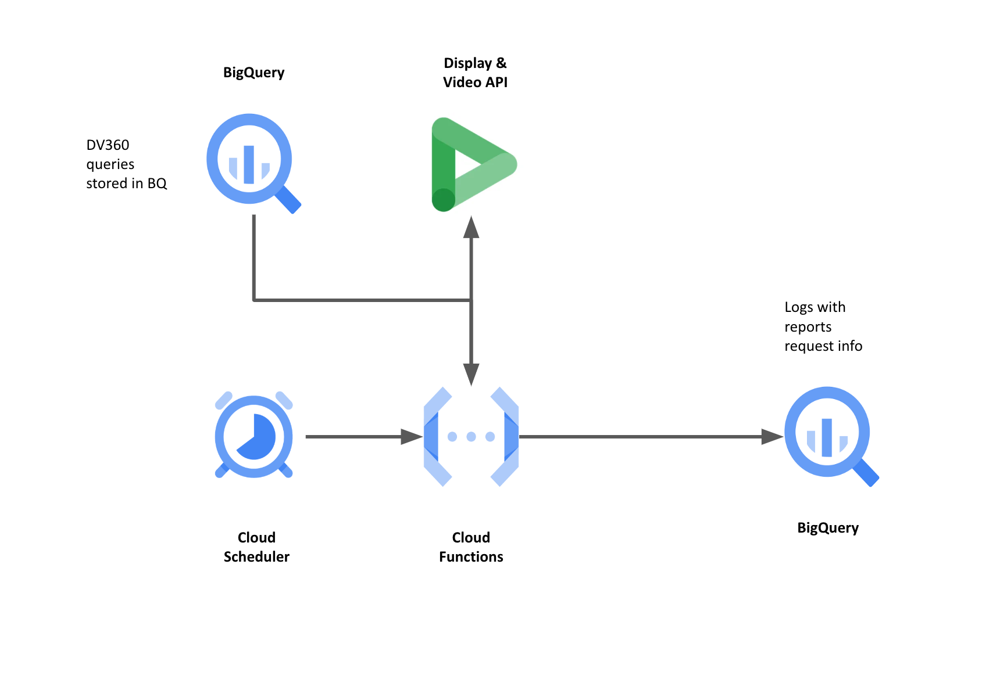

# dv360_reports_create

This function will hit DV360 API to request the creation of a new report
with a specific date for an already existing query in DV360.
The results of each request is saved into a logs table in BigQuery specified by the user.

The download of the reports are done by a second Cloud Function named `dv360_reports_download`.

### Diagram



## Setup

### Pre-requisites

This function takes as an input the queries ids already created for every account and stored in a BigQuery table, which should be provided by the user.
The schema for that table should be like this:

```json
{
  "report_name": "[STRING] Name to identify type of report",
  "partner_id": "[STRING] The partner ID",
  "title": "[STRING] report_name + partner_id",
  "query_id": "[STRING] The query id created in DV360"
}
```

You will find a notebook (`create_queries.ipynb`) you can run to create these queries and store them in a BigQuery table with the mentioned schema.

### Google Cloud Project

- Setup a Google Cloud project.
- Create a new IAM Service Account ().
- Create a dataset in BigQuery to save logs tables.
- Add the following roles in IAM to the service account:
  - Service Account User
  - Cloud Functions Invoker
  - Cloud Functions Developer
  - Cloud Scheduler Job Runner
  - Cloud Storage Object Admin
  - BigQuery Admin
- Deploy dv360_reports_create code to your cloud project using the same service account you created in the previous step.

### Google Cloud Scheduler

- Create a Scheduler Job with:

  - Frequency: `0 14 * * *`
  - Target: Cloud Function endpoint
  - Body:

```json5
{
  logs_dataset_id: "Name of the dataset for the logs table",
  logs_table_id: "Name of the table where the logs will be stored",
  report: "Name of the report to run. This should match the name in the queries table provided as an input",
  data_range: "Type of data range. Must be the same as the one which was used to create the query. Check valid inputs ",
}
```

- If the data_range provided is CUSTOM_DATES, is going to be required the start and end dates.
- Should be the following structure:

```json5
{
  logs_dataset_id: "BQ Dataset",
  logs_table_id: "BQ table",
  report: "report_id",
  data_range: "CUSTOM_DATES",
  customStartDate: "YYYYMMDD",
  customEndDate: "YYYYMMDD",
}
```

VALID_DATA_RANGE = ["CUSTOM_DATES","CURRENT_DAY","PREVIOUS_DAY","WEEK_TO_DATE","MONTH_TO_DATE","QUARTER_TO_DATE","YEAR_TO_DATE","PREVIOUS_WEEK","PREVIOUS_MONTH","PREVIOUS_QUARTER","PREVIOUS_YEAR","LAST_7_DAYS","LAST_30_DAYS","LAST_90_DAYS","LAST_365_DAYS","ALL_TIME","LAST_14_DAYS","LAST_60_DAYS"]

### Notes:

- Logs with metadata of every report request can be found in the `poc_dv360_reports` dataset in BigQuery.

- There is no need to create the logs table, the function will take care of that, but the dataset needs to be created beforehand.

- If you want to change the table name in BigQuery you will have to replace the variable in the main.py file.

### Download a specific date report (Backfilling)

- Just trigger the Cloud Function by calling the endpoint with the following argument:

  - `date=YYYYMMDD`

- If the report for that day already exists for a profile, the request will be skiped.

### Error handling

- If it fails, check the logs for error messages and ensure all the above
  steps have been appropriately followed, with the correct permissions.

- Once the logs have been checked, you could run the CF again with the date that failed
