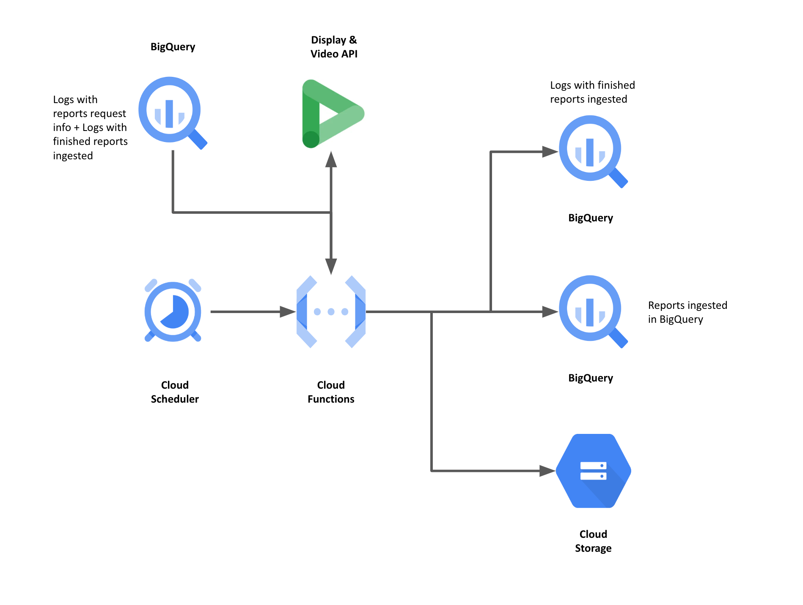

# dv360_reports_download

This function will hit DV360 API to download the reports requested in the previous step, using as an input the body parameters in the HTTP POST request when calling the function.
The function will download and ingest the reports in the respective table in BigQuery and also save a copy of the report in GCS for historical purposes.
Finally, it will save a log in a BigQuery table indicating if the report was successfully ingested or not.

### Diagram



## Setup

### Pre-requisites

This functions runs after the `dv360_reports_create` function. Please keep in mind that the reports take some time to be created by the DV360 API, so leave a gap of at least 1 hour between each run to be sure the reports are ready.
Reports generation times may vary.
If the reports are not ready the function will skip them.

### Google Cloud Project

- Setup a Google Cloud project.
- Create a new IAM Service Account (dv360-api-reporting@mdlz-na.iam.gserviceaccount.com).
- Create a dataset in BigQuery to save logs tables.
- Add the following roles in IAM to the service account:
  - Service Account User
  - Cloud Functions Invoker
  - Cloud Functions Developer
  - Cloud Scheduler Job Runner
  - Cloud Storage Object Admin
  - BigQuery Admin
- Deploy dv360_reports_create code to your cloud project using the same service account you created in the previous step.

### Google Cloud Scheduler

- Create a Scheduler Job with:

  - Frequency: `0 14 * * *`
  - Target: Cloud Function endpoint
  - Body:

```json5
{
  "bq_report_destination_table" : "Table in which the report will be appended",
  "bq_report_destination_dataset" : "Dataset in which the report will be appended",
  "bq_logs_table" : "Table where the logs with the requested reports are stored",
  "bq_finished_table" : "Table where the logs of the completed reports will be stored",
  "destination_folder" : "Path in GCS where the reports will be saved"
}
```

### Notes:

- Logs with metadata of every report request can be found in the `poc_dv360_reports` dataset in BigQuery.

- There is no need to create the logs table, the function will take care of that, but the dataset needs to be created beforehand.

- If you want to change the table name in BigQuery you will have to replace the variable in the main.py file.

- In every run the function will find all pending reports, no matter the date, and try to ingest them into BigQuery.

### Error handling

- If it fails, check the logs for error messages and ensure all the above
steps have been appropriately followed, with the correct permissions.